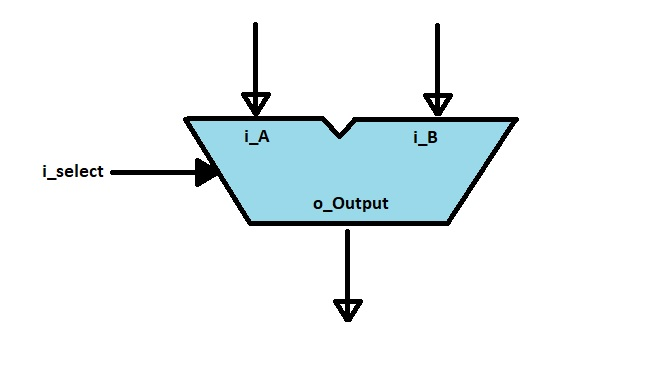

# Arithmetic logic unit in vhdl
A simple 8-bit arithmetic logic unit (alu) created in vhdl



## Pinout
| Pin           | Number of bits|
| ------------- |:-------------:|
| i_A           | 8 bit         |
| i_B           | 8 bit         |
| i_select      | 4 bit         |
| o_Output      | 8 bit         |

```vhdl
entity alu is
    port(
        i_A : in std_logic_vector(7 downto 0); 
        i_B : in std_logic_vector(7 downto 0);
        i_select : in std_logic_vector(3 downto 0);

        o_Output : out std_logic_vector(7 downto 0)
    );
end;
```

## Select
i_select is a 4 bit input signal for choosing an operation

| Value         | Operation     | Output        |
| ------------- |:-------------:| :---------     |
| 0000          | Addisjon      | i_A + i_B     |
| 0001          | Subtraction   | i_A - i_B     |
| 0010          | Multiplication| i_A * i_B     |
| 0011          | Division      | i_A / i_B     |
| 0100          | Modulo        | i_A mod i_B   |
| 0101          | Remainder     | i_A rem i_B   |
| 0110          | Left shift    | i_A << 1      |
| 0111          | Right shift   | i_A >> 1      |
| 1000          | Left rotate   | i_A rol 1     |
| 1001          | Right rotate  | i_A ror 1     |
| 1010          | And           | i_A and i_B   |
| 1011          | Or            | i_A or i_B    |
| 1100          | Xor           | i_A xor i_B   |
| 1101          | Nor           | i_A nor i_B   |
| 1110          | Nand          | i_A nand i_B  |
| 1111          | Comparison    | i_A > i_B     |
